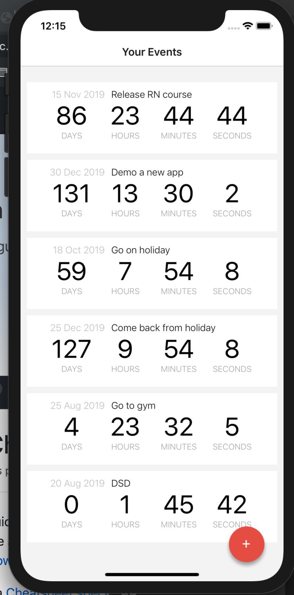

# Countdown IOS APP

Countdown is a IOS APP buit by React Native

{height=250px}

## Tech:

- React Navtive
- react-native-action-button
- react-native-modal-datetime-picker
- prop-types
- uuid

# Backend deploy

- use `expo start` to watch and run the app
- use `json-server --watch db.json -p 3005` to open the server located in countdown-api folder

# Issues

- can't call the localhost api from the iphone connected by LAN, use IOS simulator for temp to solve the problem at the moment. Have try replace the localhost by physical ip Address still got the problem.

# Future

- add delete function
